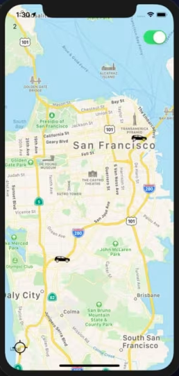

## Environment Setup
In order to start the development process, you are going to need to prepare a few prerequisites.
* Visual Studio Code.
* Node.js
* Terminal / Console
* XCode (for iOS simulation)
* Android Studio (for Android simulation)
* Install React Native CLI
```
sudo npm install -g react-native-cli
sudo npm install -g react-native
```



## Build & Run

In the constructor in App.js, replace your publish and subscribe keys with the string values respectively. 

Save any changes, and run the application with iOS devices using ```react-native run-ios``` or ```react-native run-android``` for Android devices.
